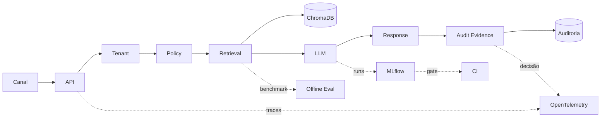

# Chat Pref

### Plataforma de Atendimento Institucional: IA, RAG e Arquitetura Tenant-Aware


O **Chat Pref** é uma base de engenharia projetada para demonstrar, de forma rastreável e auditável, como implantar fluxos de LLM aplicados (GenAI) em ambientes governamentais e institucionais, nos quais **latência**, **isolamento de dados** e **segurança de marca** não são opcionais.

⚠️ **Para fins de avaliação de arquitetura ou bancas técnicas, visite a home de Portfólio:**
👉 [Acessar Estudo de Caso Principal](docs-fundacao-operacional/estudo_de_caso.md)

---

## 🏛 Principais Capacidades da Arquitetura

O foco deste repositório não é um front-end comercial, mas a solidez do **Backend GenAI** e sua **Fundação Operacional**:

- **Isolamento Tenant-Aware por Design:** O `tenant_id` é o guardrail absoluto. Nenhum documento se mistura na Collection Vetorial (ChromaDB) e nenhuma requisição segue no pipe sem seu contexto explícito.
- **RAG Limpo e Boilerplate-Free:** Em vez de frameworks mágicos (`Langchain`/`LlamaIndex`), as injeções de embeddings são escritas proceduralmente em roteadores assíncronos do FastAPI, garantindo extrema baixa latência e observabilidade contínua.
- **Políticas Restritivas (Guardrails):** Fluxos de validação de query (`policy_pre`) e resposta (`policy_post`) que abortam a emissão e disparam *fallbacks* determinísticos antes mesmo de onerar provedores comerciais.
- **Observabilidade Estrutural:** Telemetria centralizada em `X-Request-ID`. Métricas via OpenTelemetry integradas em logs JSONL auditáveis.
- **Dual Pipeline (Síncrono vs Experimentos):**
  - **Fluxo Síncrono:** Focado em tempo de resposta da API na AWS (Terraform/EC2/Docker).
  - **Fluxo Offline (LLMOps):** Focado em testes semânticos, drift e benchmark com MLflow executando pipelines separados.

> *Para uma leitura executiva aprofundada dos limites deste sistema, consulte nossa documentação de [Decisões e Trade-Offs](docs-fundacao-operacional/tradeoffs_decisoes.md) e [Matrizes de Capacidade](docs-fundacao-operacional/matriz_capacidades.md).*

---
## Fluxo end-to-end


--- 

O fluxo principal começa no canal de entrada e segue pela API, que resolve o tenant, aplica as políticas de segurança, recupera contexto no RAG e aciona o adaptador LLM para compor a resposta. A saída é devolvida com trilha de auditoria e evidência operacional da decisão. Em paralelo, benchmark offline, tracking experimental em MLflow, observabilidade e CI permanecem separados do runtime transacional para preservar governança, reprodutibilidade e clareza arquitetural.

---

## Onde Estão as Evidências do Projeto

As evidências do projeto não ficam concentradas em um único artefato. Elas estão distribuídas por camadas diferentes, cada uma responsável por comprovar um aspecto específico da solução.

### 1. Evidência operacional do runtime
Comprova que o sistema funciona no fluxo transacional real.

Inclui, por exemplo:

- auditoria operacional por request e por tenant
- `request_id` e trilha de execução
- `reason_codes`, bloqueios, fallback e status de decisão
- logs estruturados
- métricas expostas
- traces correlacionados

Essa camada responde perguntas como:
- a API executa de ponta a ponta?
- a decisão ficou rastreável?
- houve bloqueio, fallback ou resposta normal?
- o fluxo respeita o tenant e o contexto operacional?

### 2. Benchmark offline e tracking experimental
Comprova que o sistema foi avaliado com método, e não apenas implementado.

Inclui, por exemplo:

- benchmark reproduzível por tenant
- datasets controlados
- avaliação formal offline de RAG
- comparação entre runs
- baseline inicial e baseline promovida
- tracking experimental em MLflow com parâmetros, métricas e artefatos

Essa camada responde perguntas como:
- houve comparação técnica entre variantes?
- a escolha de configuração foi justificada?
- existe baseline rastreável?
- as decisões são reproduzíveis?

### 3. Documentação técnica consolidada
Comprova que a solução pode ser entendida, explicada e defendida sem depender de improviso.

Inclui, por exemplo:

- arquitetura consolidada
- planejamento por fases
- documentação de governança e evidência
- estudo de caso
- roteiro de demonstração
- narrativa de trade-offs e decisões

Essa camada responde perguntas como:
- o que foi realmente entregue?
- quais decisões de engenharia foram tomadas?
- quais limites foram declarados?
- como apresentar o projeto com clareza?

### 4. CI e validadores automatizados
Comprova que parte relevante do projeto pode ser verificada de forma repetível.

Inclui, por exemplo:

- workflows de CI
- gates de validação
- dry-run experimental
- scripts de validação documental e estrutural
- testes mínimos de sanidade

Essa camada responde perguntas como:
- a base do projeto continua íntegra?
- a documentação está coerente com os artefatos?
- a trilha de execução é reproduzível?
- o projeto depende ou não de validação manual improvisada?

### 5. README como índice de entrada
O README funciona como ponto de navegação para as evidências, apontando para os materiais mais importantes do projeto.

Ele não substitui benchmark, auditoria ou tracking, mas ajuda a localizar rapidamente:
- o estado atual da solução
- os principais componentes
- os artefatos de estudo de caso
- a documentação de arquitetura
- os materiais de demonstração

### Resumo
As evidências do projeto estão distribuídas entre:

- runtime operacional
- auditoria e governança por request
- benchmark offline
- tracking experimental
- documentação técnica
- CI e validadores

Essa separação é intencional: ela preserva clareza arquitetural, evita misturar operação com experimento e torna a solução mais defensável do ponto de vista técnico.

---

## 💻 Como Explorar (Execução Local / Lab)

O projeto requer um ambiente simples embasado em Docker para simular seu ambiente completo na sua máquina.

Para um ensaio rápido dos fluxos, disponibilizamos um **workshop guiado**:
👉 [Abrir Roteiro de Demonstração (Walkthrough Mínimo)](docs-fundacao-operacional/roteiro_demonstracao.md)

### Subindo a Base
Se apenas quiser visualizar o backend isolado operando local:
```bash
docker compose up -d --build
```
*A API será exposta em `http://localhost:8000`. Teste imediato em `/health`.*

---

## ⚙️ Stack Tecnológica Consolidada

- **Linguagem Principal:** Python 3.11+
- **API Mínima e Assíncrona:** FastAPI (Pydantic / Uvicorn)
- **Banco Vetorial:** ChromaDB embeddado (persistência em subpartições por tenant)
- **Tracing, Logging e Métricas:** OpenTelemetry (`X-Request-ID` injetado na sessão)
- **LLMs e IA:** Google Gemini (Opcional transacional) e Provedores Estocásticos Mockados (Usados ativamente em CI para economia de requests).
- **LLMOps (Offline):** MLflow local para armazenar artefatos de testes de regressão semântica.
- **Infra e Deploy:** Terraform na AWS (EC2/single-node), provisionado de forma segura e idempotente.
- **Integração Externa:** Webhook Https para Telegram (Demonstrativo).

---

## 📂 Organização da Documentação Executiva

O projeto divide historicamente as documentações pelos seus estágios de operação arquitetural:

* [Docs da Fundação Operacional](docs-fundacao-operacional/) - Onde a base funcional garantidora (`chat`, `webhook`, `guardrails`, `rag`) foi firmada e registrada.
* [Docs da Trilha de LLMOps](docs-LLMOps/) - Onde artefatos experimentais, avaliadores offline de drift semântico e pipelines com MLFlow são geridos sem impacto no servidor online.
