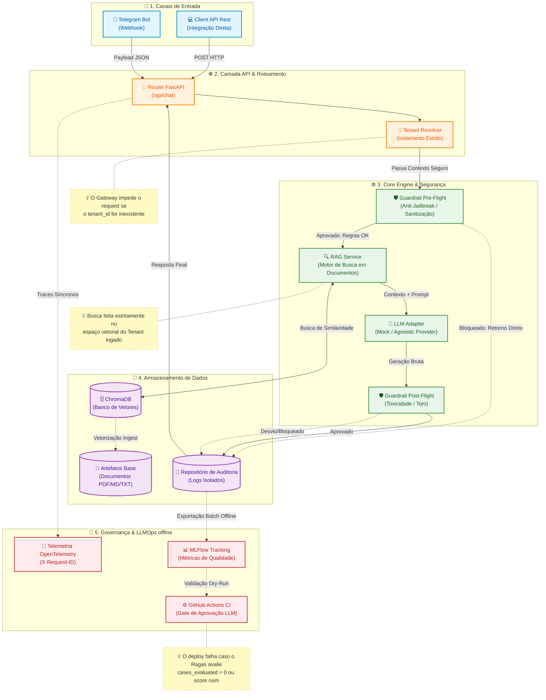

# Diagrama de Fluxo End-to-End do Sistema

Este diagrama ilustra a arquitetura completa da aplicação, destacando o isolamento multitenant, os *guardrails* de segurança e o pipeline de LLMOps (teste e tracking contínuo).

